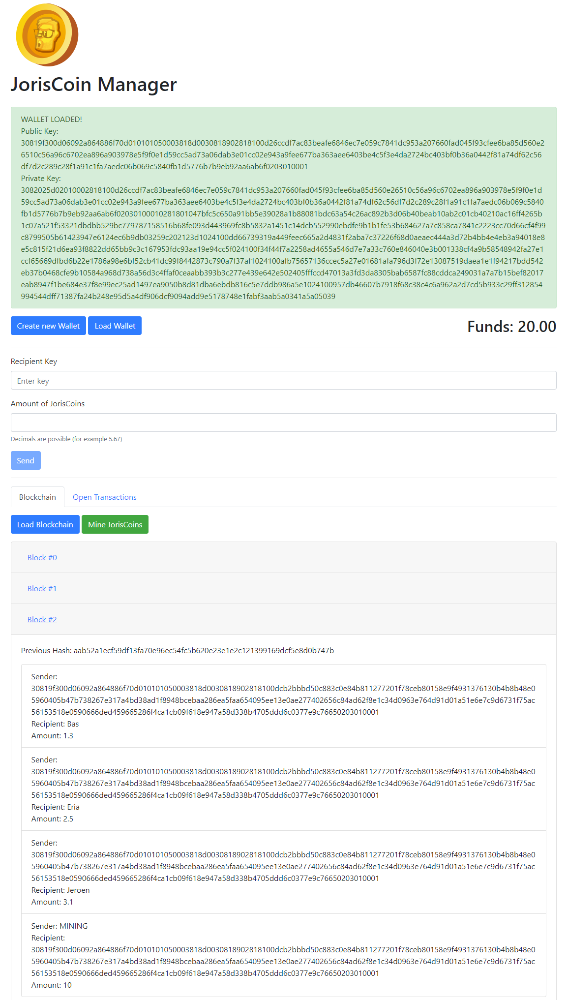

# blockchain-manager
A web application with a Python (Flask) backend and a HTML + JavaScript (Vue.js) frontend, where the user can manage a blockchain that uses a fictitious cryptocurrency called 'JorisCoins'. 

###### Features
- Security based on stored 'previous hashes', proof of work, and the signing of transactions.
- A node network can be simulated by adding peer nodes with different port numbers. Peer nodes will verify new transactions and blocks that are added by a local node. 
- Each node's wallet and blockchain are stored locally in a .txt file.
- This blockchain uses a consensus algorithm based on 'The longest valid blockchain wins'.  

###### Install notes
This app utilizes three third-party Python packages [PyCryptodome](https://pycryptodome.readthedocs.io/en/latest/index.html#), [Flask](https://palletsprojects.com/p/flask/) and [Requests](https://2.python-requests.org/en/master/). These can be installed using these terminal commands:
- `python -m pip install pycryptodome`
- `python -m pip install Flask`
- `python -m pip install requests`

###### Usage instruction
1. Start up some nodes with the terminal command `python node.py -p [portnumber]` For example: `python node.py -p 5000`
2. Start the clients in your browser, using their portnumber: For example: [http://localhost:5000/](http://localhost:5000/)
3. Create a wallet for each node, or load an existing wallet. A public and private key will be generated.
4. Create a peer node network. In the 'Network' tab manually add the nodes which you want to be the peer nodes for the current node.
5. For every block you mine, you will receive a reward of 10 JorisCoins to your funds.
6. You can send JorisCoins to other nodes in your network. Use the public key of a peer node as the recipient.
7. Once you've send a transaction, it will be added to the open transactions.
8. When you mine a block, the open transactions will be bundled into a new block and added to the blockchain.

Tip: Hit the load button to refresh a specific interface element.

###### Demo
A demo video (in Dutch) can be found [here](https://vimeo.com/409288060)

