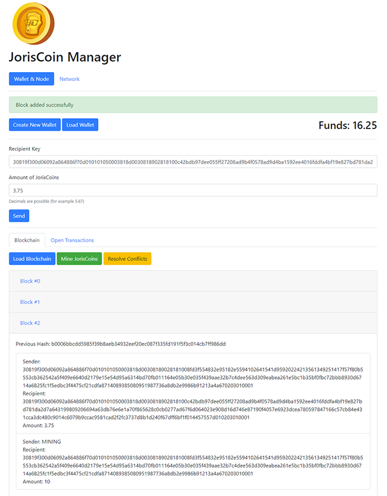

# blockchain-manager
A web application with a Python (Flask) backend and a HTML + JavaScript (Vue.js) frontend, where the user can manage a blockchain that uses a fictitious cryptocurrency called 'JorisCoins'.  

###### Install notes:
This app utilizes two third-party Python packages [PyCryptodome](https://pycryptodome.readthedocs.io/en/latest/index.html#) and [Flask](https://palletsprojects.com/p/flask/). These can be installed using these terminal commands:
- `python -m pip install pycryptodome`
- `python -m pip install Flask`

###### Execute the app:
1. Start the server with the terminal command `python node.py`
2. Start the client in your browser: [http://localhost:5000/](http://localhost:5000/)

